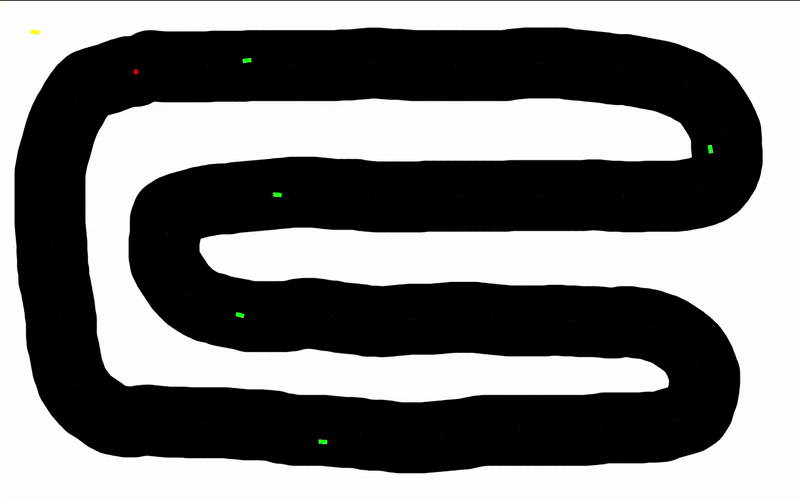

# Sensor Based Autonomous Driving Model

This project is a simulation of an **autonomous car** navigating a predefined **race track** using **sensors and AI-based logic**. It is developed in C++ using the **SFML** library for graphics and **CMake** for building the project.

---

## Controls

- Press `R` to spawn a new car  
- Press `L` to activate sensors  
- Press `C` to remove all cars  
- Use `W`, `A`, `S`, `D` to manually control your own car

---

## Demo



# Clone the repository
```bash
# Clone the repository
git clone hhttps://github.com/dankostjuk/Sensor-Based-Autonomous-Driving-Model.git

# Build the project
cd Sensor-Based-Autonomous-Driving-Model
mkdir build
cd build
cmake ..
make

# Run the simulation
./bin/main
